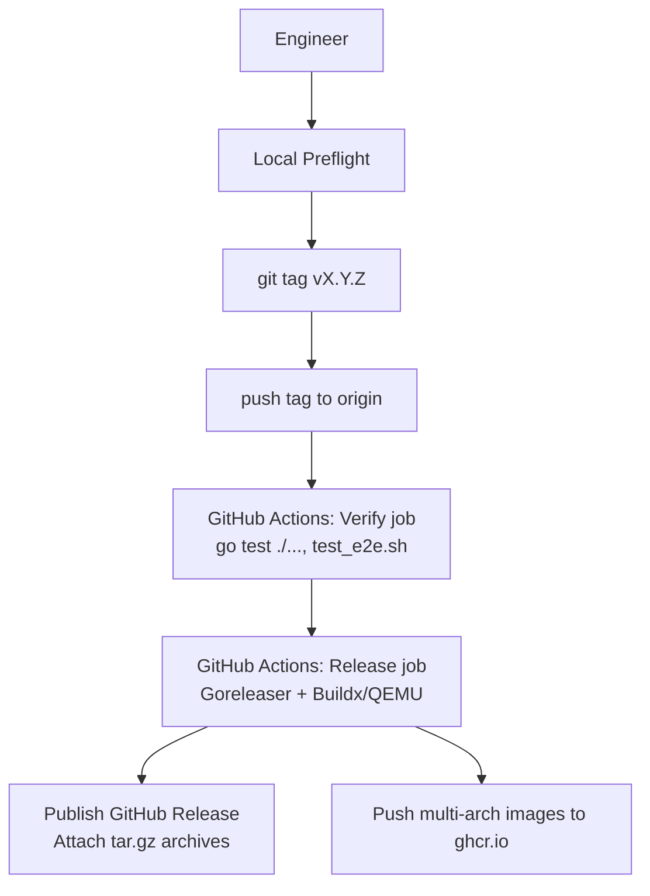

# Release Process

This document describes how we cut a Leash release, why the workflow looks the way it does, and how to dry-run everything locally before tagging `vX.Y.Z`.

## Flow Overview



## Intentional Design Choices

- **Git tags drive releases** - We follow Go’s module versioning (`vX.Y.Z`) so that module consumers receive semantic guarantees, and CI has an unambiguous trigger for official builds.
- **CI builds the final artifacts** - GitHub Actions provides a reproducible environment with Buildx/QEMU configured for multi-architecture images, eliminating the need for engineers to manage emulation locally.
- **Goreleaser owns packaging** - One tool produces cross-platform binaries, tar.gz archives, and Docker images. This keeps the output identical whether run locally or in CI.

## Before You Tag

1. Ensure the tree is clean and tests pass:

```bash
timeout 40 go test ./... -count=1
timeout 40 ./test_e2e.sh
```

2. Sanity-check your workspace:

```bash
git status --short              # should be empty
git describe --tags --exact-match  # should print vX.Y.Z (or fail if not tagged yet)
docker login ghcr.io            # ensure credentials exist before tagging
```
3. Optional: run the full Goreleaser dry run (builds all archives/images locally but skips publication):

```bash
./build/lsm-generate.sh     # runs docker-based LSM generation on non-Linux hosts
LSM_GENERATE_MODE=skip goreleaser release --snapshot --clean --skip=publish --skip=announce --skip=sign
```

*The first run regenerates Linux eBPF bindings; subsequent dry-runs can set `LSM_GENERATE_MODE=skip` to save time.*

## Cut the Release

1. Create an annotated tag following `vX.Y.Z`:

```bash
git tag -a v1.2.3 -m "Leash v1.2.3"
git push origin v1.2.3
```

2. GitHub Actions picks up the tag and executes:
   - **verify job** (Ubuntu runner): runs `go test ./...` and `./test_e2e.sh`.
    - **release job** (Ubuntu runner):
      - Sets up Go, QEMU, and Buildx.
      - Authenticates to GHCR with the workflow token.
      - Runs `./build/lsm-generate.sh` to bake Linux eBPF bindings inside Docker.
      - Runs `goreleaser release --clean` to build darwin/linux binaries (amd64 & arm64) and tar.gz archives.
      - Runs `./build/publish-docker.sh vX.Y.Z` to build and push multi-arch Docker images (linux/amd64, linux/arm64).

## What You Get

- GitHub Release assets:
  - `leash_<version>_<os>_<arch>.tar.gz`
- Container registry:
  - Manifest lists for `ghcr.io/strongdm/leash:{vX.Y.Z,latest}` (linux/amd64 & linux/arm64)
  - Manifest lists for `ghcr.io/strongdm/coder:{vX.Y.Z,latest}`

If any step fails, the workflow halts and no release is published. Fix the issue (e.g., broken test, missing login) and re-push the tag once resolved.

