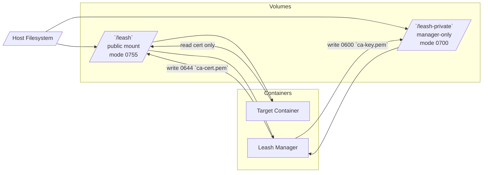

# Leash Architecture

## Overview

Leash is a multi-layer agent governance system that combines kernel-level enforcement (eBPF LSM) with application-layer intelligence (MITM proxy) to provide comprehensive runtime security for AI agents and autonomous systems.

## Why eBPF LSM?

### The Decision Matrix

When building Leash, we evaluated four major Linux security mechanisms:

| Mechanism | Seccomp-BPF | Landlock | AppArmor/SELinux | **eBPF LSM** |
|-----------|-------------|----------|------------------|--------------|
| **Hook Point** | Syscall entry | Pathname resolution | Pathname + inode | LSM hooks (file_open, bprm_check, socket_connect) |
| **Context Available** | Syscall number + args only | File descriptor + path | Full task context | Full kernel object + context |
| **Policy Expressiveness** | Binary allow/deny | Path hierarchy | Complex rules + contexts | Arbitrary logic in BPF |
| **Hot Reload** | No (re-attach per process) | No (requires new FD) | Yes (profile reload) | Yes (BPF map updates) |
| **Observability** | Audit mode (no metadata) | No built-in | auditd (external) | Ring buffers (rich events) |
| **Kernel Version** | 3.5+ | 5.13+ | Ancient (2.6 era) | 5.7+ (LSM BPF) |
| **Performance** | Low overhead | Low overhead | Medium overhead | Low overhead |
| **Userspace Complexity** | High (kafel compiler) | Medium | High (policy language) | Medium (libbpf + Go) |

### Why We Chose eBPF LSM

**1. Rich Context for Decision-Making**

Seccomp operates at syscall entry, before the kernel has resolved pathnames or validated file descriptors. This means:
- Cannot distinguish `/etc/passwd` from `/home/user/passwd` without complex path walking in BPF
- Cannot see the actual file being opened, only the syscall arguments
- TOCTOU vulnerabilities (path can change between check and use)

eBPF LSM hooks fire *after* the kernel has done the heavy lifting:
- `file_open` hook receives a fully-resolved `struct file *` with dentry, inode, mount info
- `bprm_check_security` has the complete executable path and arguments
- `socket_connect` has resolved address structures

Example from `internal/lsm/bpf/lsm_open.bpf.c:288`:
```c
// We get a trusted struct file * pointer, already validated by the kernel
int ret = bpf_d_path(&file->f_path, path, sizeof(path));
```

Compare to seccomp, which would need to:
1. Extract `const char __user *filename` from syscall args
2. Copy from userspace (untrusted)
3. Walk the path manually (complex, error-prone)
4. Race condition: path can change after check

**2. Operation-Specific Enforcement**

Seccomp blocks entire syscalls (`open`, `openat`, `openat2`). This is too coarse:
- Can't distinguish read-only from read-write opens
- Can't allow `/workspace` reads while blocking writes
- All-or-nothing for the entire syscall family

eBPF LSM at `file_open` sees the file mode:
```c
fmode_t f_mode = BPF_CORE_READ(file, f_mode);
if (f_mode & FMODE_WRITE) {
    return OP_OPEN_RW; // Block if policy says so
}
```

This enables policies like "allow reading `/usr/include` but deny writing anywhere" without false positives.

**3. Hot Reload Without Process Restart**

Seccomp filters are immutable once attached. Changing policy requires:
- Detaching the old filter
- Reattaching a new filter
- This briefly creates a race window (unfiltered)
- Requires `CAP_SYS_ADMIN` to modify running processes

eBPF LSM uses BPF maps as the policy store:
- Update map entries from userspace (`internal/lsm/manager.go:73-130`)
- Kernel program reads maps on every hook invocation
- Atomic updates (map operations are synchronized)
- No race window, no process restart

Example: `internal/lsm/file_open.go:LoadPolicies()` updates the `policy_rules` map while the BPF program is running.

**4. Rich Observability via Ring Buffers**

Seccomp audit mode can log denials via `auditd`, but:
- No structured metadata (just syscall number)
- Separate audit subsystem (hard to correlate with app events)
- No allow events (only denials)

eBPF LSM emits rich events to ring buffers:
```c
event->pid = pid_tgid >> 32;
event->timestamp = bpf_ktime_get_ns();
event->cgroup_id = bpf_get_current_cgroup_id();
event->result = policy_result ? 0 : -13; // Decision + reason
bpf_ringbuf_submit(event, 0);
```

Userspace consumes via `internal/lsm/common.go:SharedLogger`, enabling:
- WebSocket streaming to Control UI
- Real-time policy tuning (see what would be blocked in Shadow mode)
- Forensic analysis (who did what, when, from which container)

**5. Cgroup-Scoped Enforcement**

We only want to govern specific containers (agent workloads), not the host system. eBPF LSM checks:
```c
u64 current_cgroup_id = bpf_get_current_cgroup_id();
u8 *allowed = bpf_map_lookup_elem(&allowed_cgroups, &current_cgroup_id);
if (!allowed) return 0; // Not our target, pass through
```

This requires:
- Cgroup ID extraction (eBPF primitive, not available in seccomp)
- Hash map lookup (fast O(1) check)

Seccomp cannot scope by cgroup without external orchestration.

### Why Not Landlock?

Landlock (added in Linux 5.13) is a promising alternative:
- Pathname-based access control
- Composable rulesets (layer policies)
- Unprivileged (no `CAP_SYS_ADMIN` required)

However:

**Limitations for Leash's Use Case:**
1. **No observability**: Landlock denies silently. We need event streams for Record/Shadow modes.
2. **No network control**: Landlock is filesystem-only. We need `net.send` enforcement.
3. **No hot reload**: Rulesets are immutable file descriptors. Updating policy requires creating a new FD and re-execing processes.
4. **No cgroup scoping**: Landlock applies per-process hierarchy, not per-container. We'd need to track every forked process.

**When to use Landlock:** If you need unprivileged, filesystem-only sandboxing (e.g., sandboxing a browser renderer process). Not suitable for fleet-scale agent governance.

### Why Not AppArmor/SELinux?

Both are mature, widely-deployed mandatory access control (MAC) systems. However:

**AppArmor:**
- **Pathname-based**: Policies reference `/etc/passwd`, not inodes. Vulnerable to symlink attacks unless carefully written.
- **Static profiles**: Profiles are compiled and loaded via `apparmor_parser`. Hot reload requires profile replacement and process signaling.
- **Coarse granularity**: Difficult to express "allow read but deny write" without duplicating rules.
- **Observability**: Relies on `auditd`, which is external and difficult to correlate with application logs.

**SELinux:**
- **Label-based**: Requires labeling files, processes, and sockets. Complex policy language (TE, MLS, MCS).
- **Operational burden**: Enterprises struggle with SELinux policy authoring. "Just set it to permissive" is a meme for a reason.
- **Not container-native**: SELinux predates containers. Adapting policies for ephemeral workloads is painful.

**When to use them:** System-wide hardening (e.g., Android uses SELinux, Ubuntu uses AppArmor by default). Not suitable for dynamic, policy-as-code agent governance.

---

## Leash's Architecture: Two Layers

### Layer 1: Kernel Enforcement (eBPF LSM)

**Components:**
- `internal/lsm/bpf/lsm_open.bpf.c` - File open hook
- `internal/lsm/bpf/lsm_exec.bpf.c` - Process execution hook
- `internal/lsm/bpf/lsm_connect.bpf.c` - Network connection hook

**Enforcement Flow:**
1. Agent process in target cgroup attempts operation (e.g., `open("/etc/shadow", O_RDONLY)`)
2. Kernel invokes LSM hook before completing the operation
3. BPF program checks cgroup ID against `allowed_cgroups` map
4. BPF program walks `policy_rules` map (up to 256 rules per operation type)
5. BPF program emits event to ring buffer (regardless of decision)
6. BPF program returns decision: `0` (allow) or `-EACCES` (deny)
7. Kernel enforces decision (completes or fails the syscall)

**Key Design Choices:**
- **Deny-by-default**: If no policy rule matches, default policy (from map) applies. Typically deny.
- **Longest-prefix matching**: Rules are sorted by path length (descending) for correct precedence.
- **Operation types**: `open`, `open:ro`, `open:rw` enable fine-grained control.
- **Directory semantics**: Trailing `/` in policy path means "recursive directory allowance."

### Layer 2: Application Enforcement (MITM Proxy)

**Components:**
- `internal/proxy/proxy.go` - Transparent HTTPS proxy
- `internal/proxy/ca.go` - Dynamic certificate generation
- `internal/proxy/rewrite.go` - Header rewriting rules

#### Shared Volume Responsibilities

- `/leash` (public, 0755) is bind-mounted into both the target and manager containers. It holds bootstrap markers (`bootstrap.ready`, `cgroup-path`), the `leash-entry-*` binaries, and the public CA material (`ca-cert.pem`) that the target installs into its trust store.
- `/leash-private` (manager-only, 0700) is mounted exclusively into the Leash manager. The proxy persists the private CA key (`ca-key.pem`) here with file mode `0600`, preventing the target from reading or copying signing material.
- The runner injects `LEASH_DIR=/leash` for all containers and `LEASH_PRIVATE_DIR=/leash-private` only for the manager. Darwin runtime mirrors this separation by staging a manager-private directory before a CA is loaded or generated.
- Permission enforcement is strict: `internal/runner/runner.go` chmods the private mount to `0700`, `internal/proxy/ca.go` atomically writes both artifacts with the required modes, and `internal/leashd/runtime.go` refuses to start if `LEASH_PRIVATE_DIR` is missing or too permissive.



**Why MITM Proxy?**
eBPF LSM `socket_connect` hook operates at L3/L4:
- Sees IP address + port
- Cannot see HTTP method, path, headers
- Cannot modify traffic (LSM hooks are observe-only or block)

MITM proxy operates at L7:
- Sees full HTTP request (method, path, headers, body)
- Can allow/deny based on hostname, not just IP (important for multi-tenant APIs)
- Can inject secrets (Authorization headers) without storing them in container
- Can rewrite requests (e.g., add `X-Request-ID` for tracing)

**Enforcement Flow:**
1. Agent attempts connection to `api.anthropic.com:443`
2. eBPF LSM hook fires, checks `net.send` policy, logs event
3. If allowed, iptables rule redirects to local MITM proxy (port 8080)
4. Proxy performs TLS handshake with agent (using generated cert for `api.anthropic.com`)
5. Proxy reads HTTP request, checks hostname against `connect_policy`
6. Proxy checks `rewrite.conf` for secret injection rules
7. Proxy modifies request (e.g., replaces `Authorization: Bearer FAKE-TOKEN` with real token)
8. Proxy creates new connection to upstream (with `SO_MARK` to bypass iptables loop)
9. Proxy forwards modified request to upstream, streams response back to agent

> Note: The macOS Leash CLI and companion app now rely solely on the Network Extension for enforcement; the local MITM proxy is not launched in that configuration.

**Key Design Choices:**
- **Socket marking**: Proxy outbound connections set `SO_MARK` to avoid being redirected back to proxy.
- **Certificate caching**: Generated certs are cached per hostname to reduce overhead.
- **Fail-closed**: If proxy cannot connect upstream, agent sees connection failure (not a bypass).

---

## Policy Language: Cedar Integration

**Authoritative State:** A single Cedar policy file (`/cfg/leash.cedar`) is persisted with the agent. The runtime loads this Cedar source, validates it, and transpiles it to Leash IR in memory only.

**In-memory Transpilation:** Cedar statements are compiled by `internal/transpiler/` into the structures consumed by the LSM programs and HTTP proxy. No IR is written to disk.

**Why Cedar?**
- **Expressive**: Supports conditions, hierarchies, and context-driven decisions.
- **Auditable**: Human-readable, version-controllable, easy to diff.
- **Alignment**: Matches StrongDM's MCP governance language so local and fleet policy share the same vocabulary.

**Example Cedar Policy:**
```cedar
permit (principal, action in [Action::"FileOpen", Action::"FileOpenReadOnly"], resource)
when { resource in [ Dir::"/workspace/", File::"/etc/resolv.conf" ] };
```

At runtime this statement is transpiled into the equivalent Leash IR structures before being pushed into BPF maps.

See `docs/design/CEDAR.md` for policy authoring details.

---

## MCP (Model Context Protocol) Integration

Leash includes built-in support for observing and enforcing policies on MCP tool calls made by AI agents.

**Components:**
- `internal/proxy/mcp_observer.go` - Intercepts and parses MCP JSON-RPC/SSE traffic
- `internal/proxy/proxy.go` - Evaluates MCP policies via `PolicyChecker` interface
- Cedar `Action::"McpCall"` with `MCP::Server` and `MCP::Tool` resources

**Enforcement Flow:**
1. Agent makes HTTP request to MCP server (e.g., `mcp.context7.com`)
2. eBPF LSM checks network policy, allows if server is permitted
3. MITM proxy intercepts TLS connection, reads JSON-RPC payload
4. MCP observer parses `method` field (e.g., `tools/call`) and extracts `params.name` (tool name)
5. Policy checker evaluates MCP policy rules: `CheckMCPCall(server, tool)`
6. If denied, proxy returns `403 Forbidden` with denial reason
7. If allowed, proxy forwards request to upstream server
8. Events logged to WebSocket stream with MCP metadata (server, tool, method)

**V1 Policy Semantics:**

Cedar policies support three MCP resource patterns:

1. **Server-level deny** - Blocks all MCP traffic to a server:
   ```cedar
   forbid (principal, action == Action::"McpCall", resource)
   when { resource in [ MCP::Server::"mcp.untrusted.com" ] };
   ```
   Transpiles to: `deny net.send mcp.untrusted.com` + MCP policy rule

2. **Tool-specific deny** - Blocks a specific tool on a server:
   ```cedar
   forbid (principal, action == Action::"McpCall", resource == MCP::Tool::"resolve-library-id")
   when { resource in [ MCP::Server::"mcp.context7.com" ] };
   ```
   Transpiles to: MCP policy rule (server + tool combination)

3. **Informational permit** - Recorded but not enforced (V1):
   ```cedar
   permit (principal, action == Action::"McpCall", resource == MCP::Tool::"safe-search")
   when { resource in [ MCP::Server::"mcp.internal" ] };
   ```
   Generates linter warning `mcp_allow_noop`

**Current Limitations:**
- Only `forbid` is enforced; `permit` is informational (deny-by-default not yet implemented for MCP)
- Tool-specific policies require both `MCP::Tool` and `MCP::Server` resources
- MCP observer supports JSON-RPC and SSE transports (for agent↔MCP server communication)

**Control UI Integration:**

The Control UI automatically populates structured `server` and `tool` fields when generating policies from observed MCP events:
- Frontend extracts `server=<host>` and `tool=<name>` from event details
- Backend prefers structured fields over parsing the free-form `name` field
- UI requires both server and tool for MCP policy generation (prevents accidental server-wide blocks)

---

## Modes: Record → Shadow → Enforce

Leash supports three operational modes, controlled via the `default_policy` BPF map:

**Record Mode:**
- All operations allowed
- All events logged to ring buffer
- Use case: Initial deployment, learning normal behavior

**Shadow Mode:**
- Policies evaluated, decisions logged
- Operations always allowed (policy not enforced)
- Events include `would_deny: true` field
- Use case: Testing new policies before enforcement

**Enforce Mode:**
- Policies evaluated and enforced
- Denied operations blocked at kernel level
- Events include actual decision
- Use case: Production governance

Mode transitions are live (no restart) by updating the `default_policy` map.

---

## Performance Characteristics

**eBPF LSM Overhead:**
- Hook invocation: ~100ns (negligible for file opens, which are microseconds)
- Policy evaluation: O(n) where n = number of rules (max 256, typically <50)
- Ring buffer submit: ~200ns (async, does not block syscall)

**MITM Proxy Overhead:**
- TLS handshake: ~1ms (cached after first connection to a hostname)
- Request forwarding: ~100µs (memory copy + header rewrite)
- Throughput: ~10k req/s per core (bottleneck is Go runtime, not policy)

**Total overhead:** <1% for typical agent workloads (mostly compute-bound, not I/O-bound).

---

## Security Considerations

**Threat Model:**
Leash assumes:
- Trusted kernel (if kernel is compromised, no userspace security mechanism helps)
- Trusted Leash manager process (runs privileged to load BPF programs)
- Untrusted agent process (may be malicious or compromised)

**What Leash Prevents:**
- Unauthorized file access (reads/writes outside policy)
- Unauthorized process execution (blocking shell escapes, privilege escalation)
- Unauthorized network egress (data exfiltration)
- Credential leakage (secrets never touch target container)

**What Leash Does NOT Prevent:**
- Memory-based attacks (Spectre, Rowhammer) - outside scope of LSM
- Side-channel attacks (timing, cache) - requires hardware mitigations
- Container escape via kernel exploits - BPF programs are still in-kernel
- Covert channels (e.g., CPU usage patterns) - requires additional monitoring

**Known Limitations:**
- eBPF verifier limits: Max 256 policy rules per operation (can be increased with multiple BPF programs)
- TOCTOU in userspace: Policy decisions based on pathname, but file can change after check (mitigated by kernel-level enforcement)
- Bypass via `/proc/self/mem`: Agent could overwrite its own memory. Future work: add `ptrace` LSM hooks.

---

## Future Directions

**1. Dynamic Policy Synthesis:**
- Learn policies from Record mode events
- Suggest policy rules based on observed behavior
- `leash suggest --from events.log --output policy.cedar`

**2. Cross-Container Policies:**
- Network policies between containers (east-west traffic)
- Multi-agent coordination policies (agent A can call agent B's API)

**3. Enhanced MCP Capabilities:**
- Deny-by-default MCP enforcement with explicit permit rules
- Human-in-the-loop approval workflows

---

## References

- [eBPF LSM Documentation](https://www.kernel.org/doc/html/latest/bpf/prog_lsm.html)
- [Seccomp BPF](https://www.kernel.org/doc/html/latest/userspace-api/seccomp_filter.html)
- [Landlock LSM](https://landlock.io/)
- [Cedar Policy Language](https://www.cedarpolicy.com/)
- [BPF CO-RE (Compile Once, Run Everywhere)](https://nakryiko.com/posts/bpf-portability-and-co-re/)
