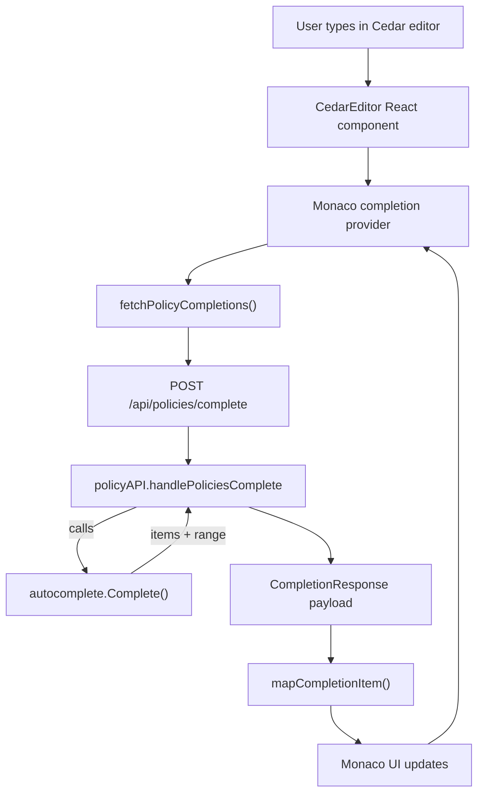
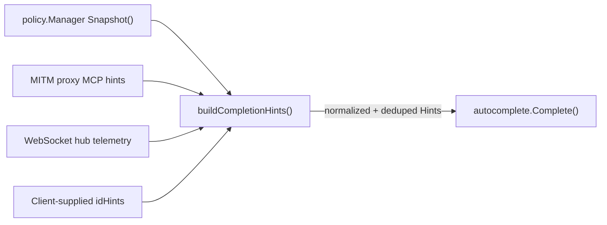
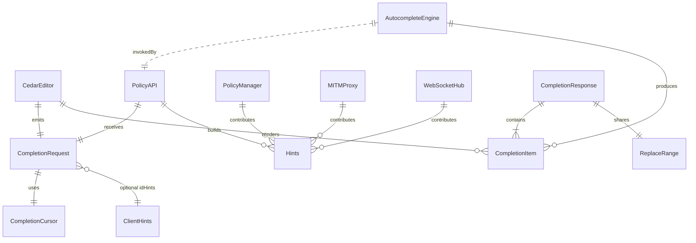

# Policy Editor Cedar Autocompletion

This document captures the end-to-end design for Leash’s Cedar autocomplete experience, spanning the front-end [Monaco](https://microsoft.github.io/monaco-editor/) integration, HTTP surfaces, and the Go autocomplete engine that synthesizes runtime hints.

## Core Entities
- **CedarEditor (React)** drives Monaco, manages abortable completion fetches, and renders contextual suggestion help sourced from the top-ranked item.
- **Monaco Completion Provider** registers for Cedar language IDs, collects the full buffer plus cursor location, and routes requests through `fetchPolicyCompletions`.
- **Policy API (`/api/policies/complete`)** validates payloads, composes dynamic hints from runtime services, and delegates to the autocomplete engine.
- **Autocomplete Engine (`internal/cedar/autocomplete`)** parses the Cedar buffer, detects editing context, ranks candidates, and returns both completion items and the replacement range.
- **Hint Contributors** include the policy manager (compiled policy sets), MITM proxy (observed MCP servers/tools), and WebSocket hub (recent HTTP metadata); optional client hints are merged last to preserve server-derived priority.
- **Completion Schema** consists of `CompletionRequest`, `CompletionResponse`, `CompletionItem`, and `ReplaceRange`, ensuring Monaco receives label/kind metadata and the span to overwrite.

## Request Flow

## Hint Aggregation Pipeline

## Data Model

## End-to-End Narrative
1. **Keystroke Handling**: The Monaco provider fires on trigger characters. `CedarEditor` aborts any in-flight request before issuing `fetchPolicyCompletions`, preventing stale completions from racing in the UI.
2. **Request Validation**: `policyAPI.handlePoliciesComplete` enforces cursor bounds, limits payload size, rejects unknown fields, and converts optional `idHints` into structured hint requests.
3. **Hint Assembly**: Runtime artifacts are snapshot and merged—policy-derived file/dir/host data, MITM-proxy MCP identifiers, WebSocket-observed HTTP headers, and client hints. The builder normalizes casing, trims whitespace, and deduplicates with caps to avoid overwhelming Monaco.
4. **Context Detection & Ranking**: `autocomplete.Complete` tokenizes the buffer, skips comment regions, inspects the AST/lint signals, and ranks candidate pools (keywords, snippets, actions, resources, MCP/HttpRewrite helpers) with prefix-sensitive scoring.
5. **Response Mapping**: The handler wraps engine output into JSON. On the client, `mapCompletionItem` converts each item into Monaco’s structure, enabling snippet insertion rules and populating the suggestion help overlay with detail/documentation.
6. **User Feedback**: Monaco renders ranked suggestions inline; `CedarEditor` mirrors the top suggestion in the contextual help panel and preserves the server-defined replacement range for consistent edits.
