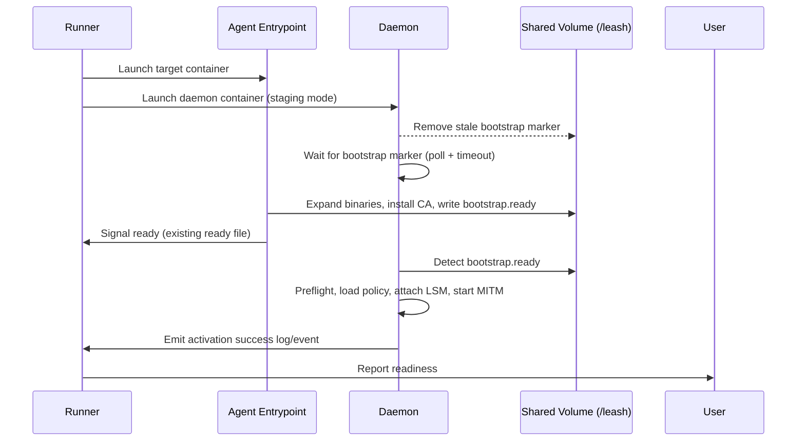
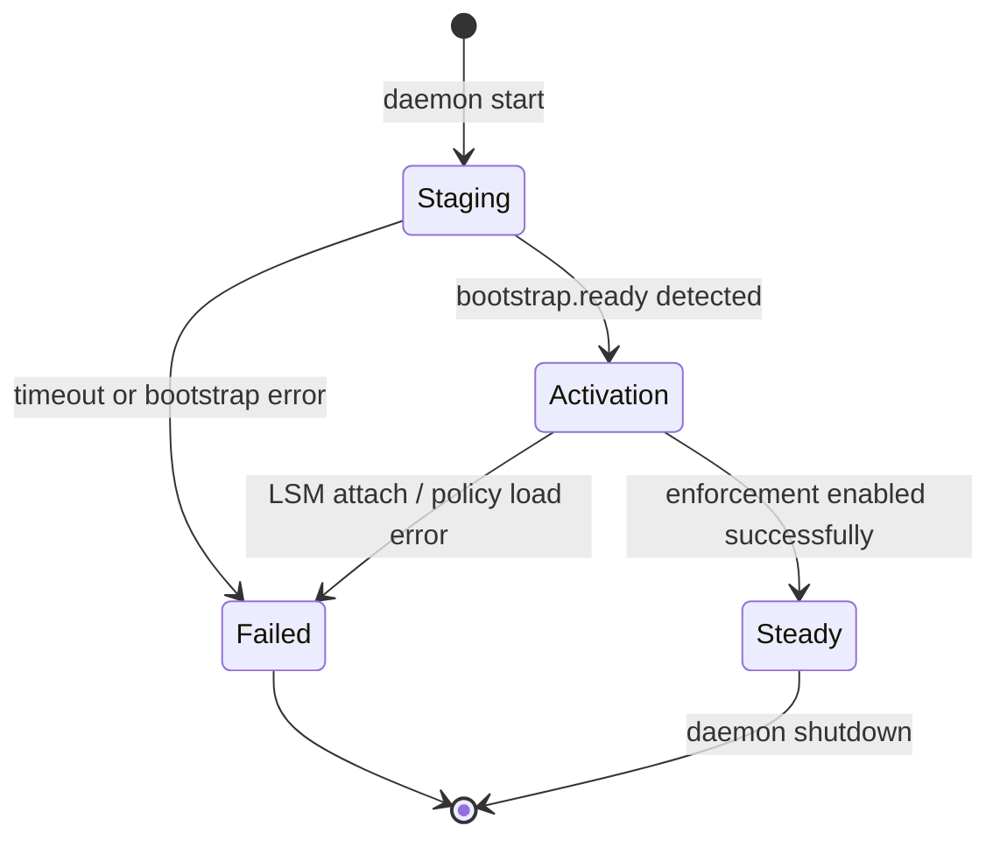

# Bootstrap-Oriented Orchestration (BOO)

## Overview

Bootstrap-Oriented Orchestration (BOOT) is the production lifecycle for Leash.
The daemon now enters a staging mode on start-up, waiting for the agent-side
`leash-entry` bootstrap to complete (CA install, helper expansion, readiness
checks) before it attaches LSM programs or starts the MITM proxy. The handshake
is mediated through `bootstrap.ready` on the shared `/leash` volume and
guarantees that policy enforcement never races ahead of the prerequisites that
make TLS interception succeed.

Key properties:

- Deterministic lifecycle: bootstrap → acknowledge → enforcement → steady state.
- Unambiguous failure surface: a missing or stale bootstrap signal results in a
  controlled teardown and an actionable user error, rather than latent TLS
  failures.
- Backward-compatible: nodes that do not emit `bootstrap.ready` are rejected
  early with guidance to upgrade both halves.

## Lifecycle

### Lifecycle Phases

1. **Staging** — Daemon starts with logging/UI but skips LSM attach, MITM proxy,
   and BPF map loads. It polls for a bootstrap marker.
2. **Bootstrap** — `leash-entry` performs CA install, decompression, and optional
   preflight checks. When successful, it writes a signed marker into `/leash`.
3. **Activation** — Daemon observes the marker, reloads policy once, then
   attaches LSM hooks and enables enforcement.
4. **Steady State** — Policy watcher resumes; subsequent edits behave as today.

### Sequence Diagram

### State Diagram

## Core Concepts & Files

| Concept           | Description                                                                 | Notes                                                         |
|-------------------|-----------------------------------------------------------------------------|---------------------------------------------------------------|
| Runner            | CLI orchestrator. Launches containers, watches bootstrap status, tears down on failure. | Gains bootstrap timeout logic and clearer error messaging.    |
| `leash-entry`     | Agent-side bootstrapper. Responsible for CA install and creating `bootstrap.ready`. | Fails fast on bootstrap issues and exits non-zero.            |
| Leash daemon      | Enforcement engine. Adds staging phase and defers policy attach until handshake. | Drops any stale marker, polls for new one, enforces timeouts. |
| Public volume     | `/leash` bind mount shared by manager and target.                           | Stores `leash-entry.ready`, `bootstrap.ready`, `cgroup-path`, and `ca-cert.pem` (0644). |
| Private volume    | `/leash-private` bind mount visible only to the manager.                    | Stores `ca-key.pem` (0600); runner enforces 0700 dir perms before launch. |
| Marker file       | `bootstrap.ready` (JSON with PID/hostname/timestamp).                        | Created atomically to avoid partial writes; cleared on start. |

## Failure Handling

- **Bootstrap timeout:** Runner aborts, stops both containers, and prints a
  targeted hint (e.g., “Bootstrap blocked: allow `/usr/sbin/update-ca-certificates`”).
- **Entry failure:** `leash-entry` exits non-zero, runner surfaces the exit code
  and relevant log excerpt so the user understands the root cause.
- **Daemon startup without marker (old entrypoint):** Daemon logs a version
  mismatch and exits with an actionable message instead of waiting forever.

## Testing Strategy

1. **Unit tests**
   - Daemon staging logic (marker detection, timeout, stale file removal).
   - Runner bootstrap watcher (success, timeout, error propagation).
2. **Integration tests**
   - Happy path with current policy and CA install (ensures curl works).
   - Failure path with policy intentionally blocking `/bin/sh` (expect runner to
     abort before user commands execute).
   - Backward compatibility check with old entrypoint (fails fast with guidance).

## Implementation Notes

- Marker metadata is plain JSON (PID, hostname, timestamp); that is sufficient
  for observability, so no extra signatures are required.
- Activation is all-or-nothing: until bootstrap completes we keep LSM/MITM
  disabled to avoid partial enforcement states.
- There is no override to bypass BOOT; allowing a skip would reintroduce the
  TLS fragility the design solved.
- The bootstrap timeout is configurable via `LEASH_BOOTSTRAP_TIMEOUT`; the
  runner passes this value to the daemon for consistent staging behaviour.
