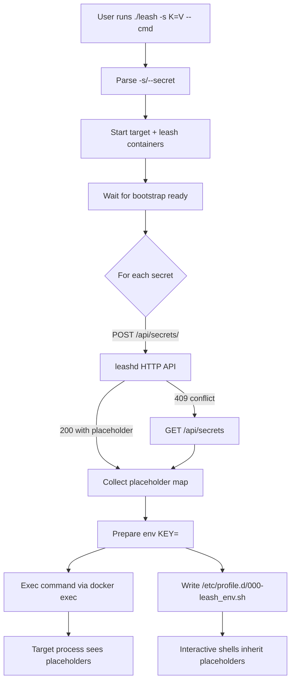
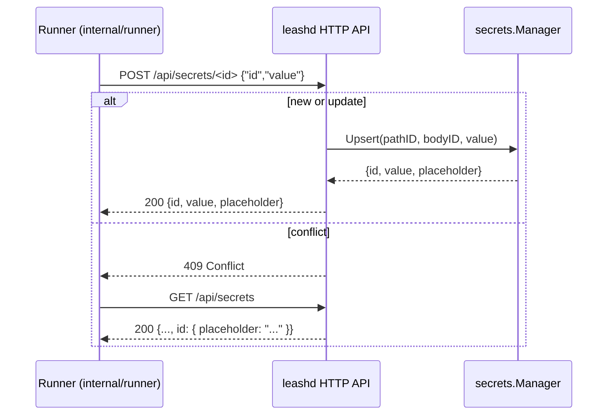
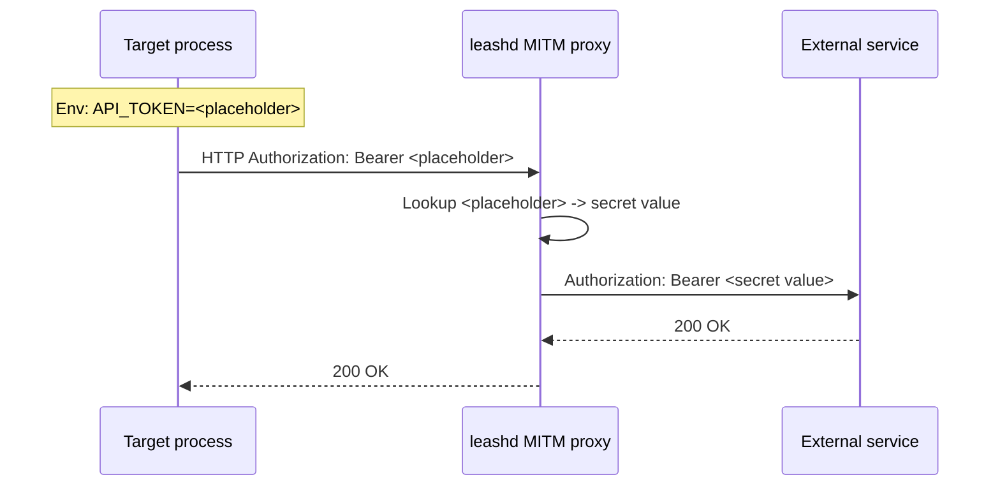

# Secure Secrets Injection (SSI)

Guide to how launch-time secure secrets injection works end‑to‑end.

This document covers intake at the CLI, registration with `leashd`, and placeholder exposure to workloads.

See also:
- Boot flow and readiness: [BOOT.md – Lifecycle Phases](BOOT.md#lifecycle-phases) and [BOOT.md – Sequence Diagram](BOOT.md#sequence-diagram)
- HTTP rewrite and secret replacement pipeline: [PROXY.md – Capabilities](PROXY.md#capabilities) and [PROXY.md – Notes](PROXY.md#notes)

## What You Get
- Register secrets once at launch with the `-s/--secret` flag; workloads (shell env and network activity) only see and use placeholder values.
- No secret values in target container env, logs, or shell history.
- Transparent replacement at egress by the MITM proxy (per [PROXY.md](PROXY.md)).

## Quick Start
- Run with secrets:
```bash
./leash -s API_TOKEN=actual-secret-here -s FOO=BAR -- bash -lc 'env | grep -E "^(API_TOKEN|FOO)="'
```
- Inspect placeholders via API:
```bash
curl -s http://127.0.0.1:18080/api/secrets | jq .API_TOKEN.placeholder
```

## CLI Reference
- Flags: `-s KEY=VALUE`, `--secret KEY=VALUE` (repeatable).
- Validation: key must be `[A-Za-z0-9_]+`; `=` is required; value may be empty but cannot be omitted.

## How It Works
1) Parse secrets: `-s/--secret KEY=VALUE` (repeatable).
2) Start target + leash; wait for bootstrap ready (see [BOOT.md](BOOT.md)).
3) Register each secret over HTTP; receive a unique placeholder.
4) Persist placeholder exports in `/etc/profile.d/000-leash_env.sh` for interactive shells
4) Execute specified command with `KEY=<placeholder>` in env

## Startup Flow


## HTTP API Contract
- Register: `POST /api/secrets/<id>` with `{ "id": "KEY", "value": "VALUE" }`.
- Success 200: returns `{id,value,placeholder}` (runner records `placeholder`).
- Conflict 409: id exists → runner falls back to `GET /api/secrets` to read the current placeholder.

### Registration Sequence


## Placeholder Exposure
- The runner injects placeholders into the target process environment as `KEY={placeholder}`. The actual secret value is never placed into target environment.
- Interactive sessions inherit the placeholder exports via `/etc/profile.d/000-leash_env.sh`.
- Replacement at egress: the MITM proxy resolves `<placeholder>` to the secret value in outbound traffic. See PROXY.md for where replacement applies.

### Placeholder Propagation


## Security: Target Workload Isolation
- Placeholders: random lowercase alphanumeric; length derived from secret length.
- Scope: secret values never enter the target env; only placeholders do.
- Surface: API + UI bind to loopback by default, target container is not permitted to access the `leashd` API.
