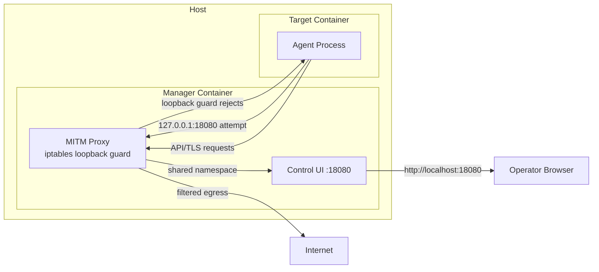

# Security Model

Leash combines kernel‑level enforcement (eBPF LSM) with an application‑layer
proxy to provide defense‑in‑depth for agent workloads.

## Trust Boundaries

- Agent container: governed workload, scoped by cgroup.
- Manager container: privileged, attaches BPF programs and runs the HTTP(S) proxy.
- Host: remains outside governance; enforcement triggers only for allowed cgroups.

## Deny‑By‑Default

Policies aim for deny‑by‑default with explicit, explainable allows. Start in
Record/Shadow to reduce friction and then enforce.

## Enforcement Layers

- Kernel (eBPF LSM):
  - `file_open` decisions including read vs. write
  - `bprm_check_security` for `proc.exec`
  - `socket_connect` for outbound `net.send`
- Proxy (HTTP[S]):
  - Allow/Deny per host
  - Header injection at the boundary (secrets never enter the agent)

### Proxy Certificate Management

- Public/private CA split: Target container only sees `/leash/ca-cert.pem`, while leashd reads `/leash-private/ca-key.pem` via `LEASH_PRIVATE_DIR` (0700) and keeps the key file mode at `0600`.

## Scoping

Enforcement activates for specific cgroups only, avoiding host/system interference.

## Observability

Structured events via ring buffers are forwarded to a WebSocket for UIs and automations. See `docs/PROTOCOL.md`.

## Leashd Manager

The manager container owns the Control UI and MITM proxy, and hard-blocks
loopback traffic from the target namespace so target containers cannot talk to
the web UI or daemon APIs directly.

- iptables/ip6tables loopback guards: on bootstrap the manager inserts
  `OUTPUT` rules that reject `127.0.0.1/::1` TCP attempts to the UI port.
- Shared namespace, enforced boundary: the target shares the manager network
  namespace for transparent proxying, but the loopback filter keeps the UI
  reachable only from the host browser.
- Host-only access: operators connect to `http://localhost:18080` from the host,
  bypassing the guarded namespace entirely.

